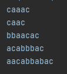

# Laboratory 1: Regular grammars

### Course: Formal Languages & Finite Automata
### Author: Musin Vladislava

----


##  Objectives:

1. Discover what a language is and what it needs to have in order to be considered a formal one;

2. Provide the initial setup for the evolving project that you will work on during this semester. You can deal with each laboratory work as a separate task or project to demonstrate your understanding of the given themes, but you also can deal with labs as stages of making your own big solution, your own project. Do the following:

    a. Create GitHub repository to deal with storing and updating your project;

    b. Choose a programming language. Pick one that will be easiest for dealing with your tasks, you need to learn how to solve the problem itself, not everything around the problem (like setting up the project, launching it correctly and etc.);

    c. Store reports separately in a way to make verification of your work simpler (duh)

3. According to your variant number, get the grammar definition and do the following:

    a. Implement a type/class for your grammar;

    b. Add one function that would generate 5 valid strings from the language expressed by your given grammar;

    c. Implement some functionality that would convert and object of type Grammar to one of type Finite Automaton;

    d. For the Finite Automaton, please add a method that checks if an input string can be obtained via the state transition from it;


## Implementation description


```
def transform_word(input_word):
    for i in P:
        if i in input_word:
            input_word = input_word.replace(i, random.choice(P[i]))
    return input_word

P={
    'S': ['aS', 'bS', 'cA'],
    'A': ['aB'],
    'B': ['aB', 'bB', 'c']
}

for j in range(5):
    word = 'S'
    while word != word.lower():
        word = transform_word(word)
    print(word)
```
In this Python code, I've defined a function transform_word and a dictionary P representing the grammar rules of a simple context-free language. The transform_word function takes an input word and applies grammar rules defined in P to transform it. It iterates over each key in P and checks if the key is present in the input word. If found, it replaces occurrences of the key with a randomly chosen replacement from the list associated with that key in the dictionary P. The function then returns the transformed word. Additionally, I've included a loop that generates and prints five random words following the grammar defined in P.
## Results:
   


## Conclusions:
In this laboratory work I have learned how to write simple functions for implementing Regular grammars

## References
Our lectures