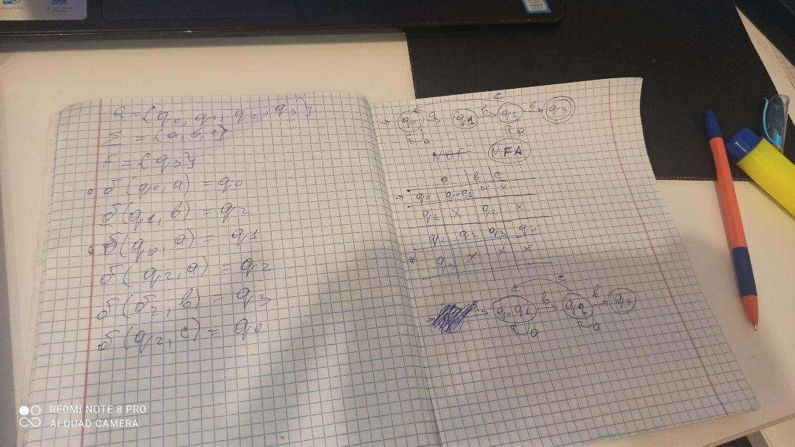

# The title of the work

### Course: Formal Languages & Finite Automata
### Author: Musin Vladislava

----


## Objectives:

1. Understand what an automaton is and what it can be used for.

2. Continuing the work in the same repository and the same project, the following need to be added:
    a. Provide a function in your grammar type/class that could classify the grammar based on Chomsky hierarchy.

    b. For this you can use the variant from the previous lab.

3. According to your variant number (by universal convention it is register ID), get the finite automaton definition and do the following tasks:

    a. Implement conversion of a finite automaton to a regular grammar.

    b. Determine whether your FA is deterministic or non-deterministic.

    c. Implement some functionality that would convert an NDFA to a DFA.
    
    d. Represent the finite automaton graphically (Optional, and can be considered as a __*bonus point*__):
      
    - You can use external libraries, tools or APIs to generate the figures/diagrams.
        
    - Your program needs to gather and send the data about the automaton and the lib/tool/API return the visual representation.

## Implementation description

* Grammar Class: This class represents a context-free grammar. It has attributes for non-terminals, terminals, and productions. It also has a method classify_chomsky to determine the type of grammar based on the Chomsky Hierarchy (Regular, Context-Free, Context-Sensitive, or Unrestricted).
* FiniteAutomaton Class: This class represents a finite automaton. It has attributes for states, alphabet, transitions, initial state, and accepting states. It also has methods to convert from a grammar, check a string against the automaton, and convert the automaton to a regular grammar.
* Helper Functions:

generate_strings: Generates valid strings based on the given grammar.
generate_string: Generates a single valid string based on the given grammar.
fa_to_regular_grammar: Converts a finite automaton to a regular grammar.
is_deterministic: Checks if the given finite automaton is deterministic.
draw_fa_graph: Prints the transitions of the finite automaton graphically.

* Main Section:

Creates a  grammar with some predefined non-terminals, terminals, and productions.
Generates and prints valid strings based on the grammar.
Converts the grammar to a finite automaton and prints it.
Converts the finite automaton to a regular grammar and prints it.
Determines if the finite automaton is deterministic and prints the result.
Draws the finite automaton graphically.
Classifies the grammar based on the Chomsky Hierarchy and prints the classification.

* Code snippets 
Grammar Class

```
class Grammar:
    def __init__(self, non_terminals, terminals, productions):
        self.non_terminals = non_terminals
        self.terminals = terminals
        self.productions = productions

    def __str__(self):
        productions_str = "\n".join([f"{non_terminal} -> {' | '.join(productions)}" for non_terminal, productions in self.productions.items()])
        return f"Non-terminals: {self.non_terminals}\nTerminals: {self.terminals}\nProductions:\n{productions_str}"

    def classify_chomsky(self):
        regular = all(len(key) == 1 and len(value)>=1 and (all(len(v) == 2 and v[0] in self.terminals and v[1] in self.non_terminals or v[0] in self.non_terminals and v[1] in self.terminals for v in value) or all(len(v)==1 and v[0] in self.non_terminals for v in value)) for key, value in self.productions.items())
        # Check if the grammar is regular
        #regular = all(len(key) == 1 and len(value) >=1 and all (v[0] in self.non_terminals and v[1] in self.terminals or v[0] in self.non_terminals and v[1] in self.terminals for k in value)
        #              for key, value in productions)

        # Check if the grammar is context-free
        context_free = all(len(key) == 1 for key,value in productions.items() )

        # Check if the grammar is context-sensitive
        context_sensitive = not regular and not context_free

        # If none of the above are True, the grammar is unrestricted
        if not any([regular, context_free, context_sensitive]):
            return "Type 0 : Unrestricted"
        elif regular:
            return "Type 3 : Regular"
        elif context_free:
            return "Type 2 : Context-Free"
        elif context_sensitive:
            return "Type 1 : Context-Sensitive"


```

FiniteAutomaton Class
```
class FiniteAutomaton:
    def __init__(self):
        self.states = set()
        self.alphabet = set()
        self.transitions = {}
        self.initial_state = None
        self.accepting_states = set()

    def convert_from_grammar(self, grammar):
        for non_terminal in grammar.non_terminals:
            self.states.add(non_terminal)
        for terminal in grammar.terminals:
            self.alphabet.add(terminal)

        for non_terminal, productions in grammar.productions.items():
            for production in productions:
                if len(production) == 1:  # Singleton production
                    self.transitions.setdefault(non_terminal, {}).setdefault(production, 'ε')
                else:
                    self.transitions.setdefault(non_terminal, {}).setdefault(production[0], production[1])

        self.initial_state = 'S'
        self.accepting_states = grammar.terminals

    def __str__(self):
        transitions_str = "\n".join([f"{state}: {transitions}" for state, transitions in self.transitions.items()])
        return f"States: {self.states}\nAlphabet: {self.alphabet}\nTransitions:\n{transitions_str}"

    def check_string(self, input_string):
        current_state = self.initial_state
        for symbol in input_string:
            if symbol not in self.transitions.get(current_state, {}):
                return False
            current_state = self.transitions[current_state].get(symbol)
            if current_state is None:
                return False
        return current_state in self.accepting_states
```

## The results
```
Valid Strings:
bbabbcabac
cabac
bbaaabbcac
acabc
aabacac

Finite Automaton:
States: {'A', 'S', 'B'}
Alphabet: {'b', 'c', 'a'}
Transitions:
S: {'a': 'S', 'b': 'S', 'c': 'A'}
A: {'a': 'B'}
B: {'a': 'B', 'b': 'B', 'c': 'ε'}

Regular Grammar:
Non-terminals: {'A', 'S', 'B'}
Terminals: {'b', 'c', 'a'}
Productions:
A -> aB
S -> aS | bS | cA
B -> aB | bB | cε

The Finite Automaton is deterministic.

Finite Automaton Graph:
S -- a --> S
S -- b --> S
S -- c --> A
A -- a --> B
B -- a --> B
B -- b --> B
B -- c --> ε
Grammar Classification: Type 2 : Context-Free
```
* Visualization



## Conclusion
Through this project, I have delved into the realm of formal language theory, grammars, and finite automata, consolidating my understanding of these core concepts in computer science. Implementing Python classes and functions to represent grammars and finite automata has not only solidified my knowledge but also honed my programming skills. By exploring aspects such as grammar classification, deterministic behavior, and conversion between different representations, I have expanded my understanding of theoretical computer science. Moreover, developing functions for string generation and graphical visualization of finite automata transitions has equipped me with valuable algorithm design and visualization skills. Overall, this project has deepened my theoretical knowledge while simultaneously enhancing my practical programming abilities.
